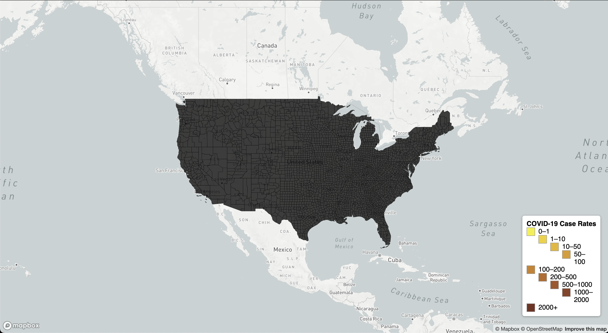
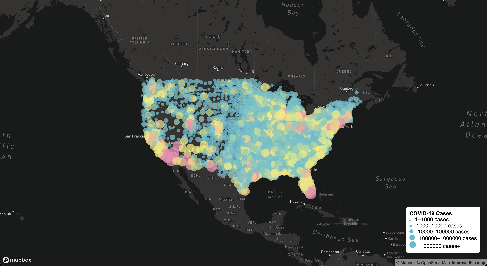

# web-map-application

## Project Overview

This project visualizes the impact of COVID-19 in the United States throughout the year 2020, focusing on case counts and case rates at the county level. Utilizing data from The New York Times and population estimates from the 2018 ACS 5-year estimates, this project presents two thematic maps: a choropleth map displaying COVID-19 rates and a proportional symbols map showing COVID-19 cases. These visualizations aim to provide insight into the geographical distribution and intensity of the pandemic across U.S. counties.

### Maps

- **COVID-19 Case Rates Map** (Choropleth): Visualizes the rate of COVID-19 cases per thousand residents in each county.
- **COVID-19 Case Counts Map** (Proportional Symbols): Displays the total number of COVID-19 cases in each county, with symbol size representing case counts.

#### Interactive Features

- Clickable dots on the proportional symbols map display detailed case information for each county.
- Legends on both maps offer guidance on interpreting the data visualizations.

### Data Sources

- COVID-19 case/death data: The New York Times
- Population data: 2018 American Community Survey (ACS) 5-Year Estimates
- County boundaries: U.S. Census Bureau

All data were processed and converted into GeoJSON format for use in this project, ensuring appropriate projections and simplification for web mapping purposes.

### Technologies Used

- Mapbox GL JS for map rendering
- GeoJSON for geospatial data representation
- HTML/CSS/JavaScript for web structure, styling, and interactivity

### Project Structure

- `map1.html`: Choropleth map of COVID-19 rates.
- `map2.html`: Proportional symbols map of COVID-19 cases.
- `/assets`: Contains GeoJSON data files and other resources used in the maps.
- `/css`: CSS files for map and page styling.
- `/js`: JavaScript files containing map functionality and interactivity.

### Viewing the Maps

The maps can be viewed online at [[https://chaerihong.github.io/web-map-application/](https://chaerihong.github.io/web-map-application/)].

### Screenshots

### Libraries and Tools

- Mapbox GL JS
- GeoJSON

### Credits and Acknowledgments

- Data provided by The New York Times and the U.S. Census Bureau.
- Map visualizations created using Mapbox GL JS.

#### Project Author

Chaeri Hong

